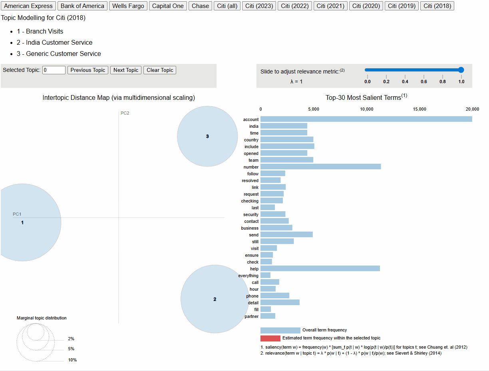
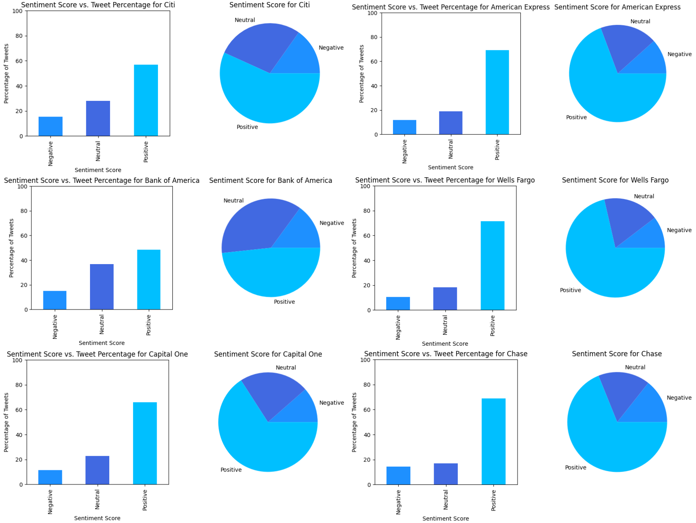
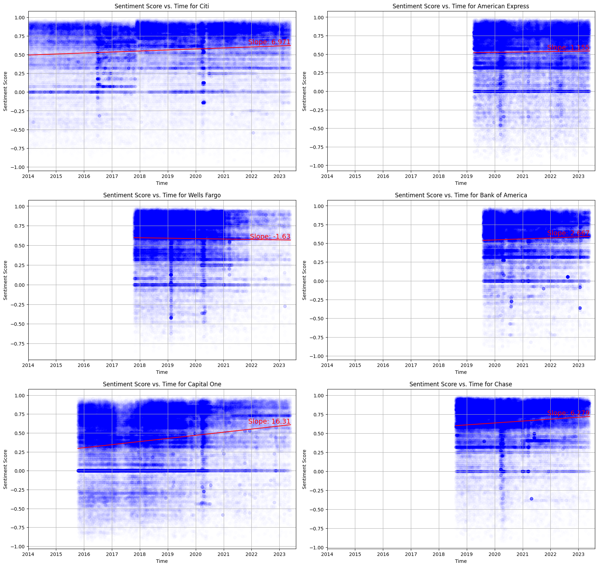

Sentiment and topic analysis of Twitter data from major US banking institutions (American Express, Bank of America, Wells Fargo, Capital One, Chase, and Citi) using NLP techniques. The analysis includes LDA topic modeling and sentiment analysis with TextBlob and VADER to identify customer concerns, satisfaction trends, and thematic patterns in banking-related tweets.

📊 **[View Presentation Slides](https://docs.google.com/presentation/d/1B_LheAtJEo0cYAIckYfw-0KTXrGUsL9USThU08aVvJE/edit?usp=sharing)**

**Analysis Steps:**
- **Data Collection & Preprocessing**: Load Twitter data from CSV files, clean text, tokenize tweets, remove stopwords, and lemmatize words using NLTK.
- **Non-English Word Filtering**: Use GloVe word embeddings to filter out non-English and meaningless words.
- **Topic Modeling**: Perform LDA topic modeling using Gensim to identify key discussion themes. Supports automatic topic discovery via coherence scores.
- **Topic Visualization**: Generate interactive pyLDAvis visualizations for each bank showing topic-word distributions.
- **Sentiment Analysis with TextBlob**: Classify tweets as Positive, Neutral, or Negative using TextBlob's polarity scores.
- **Sentiment Analysis with VADER**: Apply VADER to get compound sentiment scores (-1 to 1) for trend analysis over time.
- **Visualization**: Create bar/pie charts for TextBlob sentiment distributions and scatter plots with trend lines for VADER scores.

| Tweet ID | URL | Timestamp | Username | User Bio | Tweet |
|----------|-----|-----------|----------|----------|-------|
| 1662153678009008129 | https://twitter.com/AskCiti/status/1662153678009008129 | May 26, 2023 · 5:48 PM UTC | @AskCiti | Ask Citi | Hi Nelson, we haven't heard back and want to ensure that your concerns have been addressed. If you need our assistance, let us know. Thanks, and have a good day. ^Donnie |
| 1662153342787649539 | https://twitter.com/AskCiti/status/1662153342787649539 | May 26, 2023 · 5:46 PM UTC | @AskCiti | Ask Citi | Hello! Thank you for raising this concern about comments made by someone who identified themself as an employee. We take these issues seriously and will review internally. ^John |
| 1662140008982102039 | https://twitter.com/AskCiti/status/1662140008982102039 | May 26, 2023 · 4:53 PM UTC | @AskCiti | Ask Citi | Hello and welcome to Citibank U.S. This does not look like a valid request from Citibank. If you have any accounts or credit cards, with Citi, please DM us to confirm the type and country. Do not include any account numbers or PINs. ^Rita nitter.nl/messages/compose… |
| 1662137952191803392 | https://twitter.com/AskCiti/status/1662137952191803392 | May 26, 2023 · 4:45 PM UTC | @AskCiti | Ask Citi | The password requirements indicated ""No digital images or icons"". Based on the password you provided, it does not meet the requirements. If you wish to obtain the icons or characters that are supported, please DM us your account or card type and country. No account numbers. ^Rita nitter.nl/messages/compose… |
| 1662136062146215937 | https://twitter.com/AskCiti/status/1662136062146215937 | May 26, 2023 · 4:38 PM UTC | @AskCiti | Ask Citi | Hello and welcome to Citibank U.S. We would like to see if we can help. Please DM to confirm your account or card type, country and error codes you may receive when using the App. Do not include any account numbers or PINs. ^Rita nitter.nl/messages/compose… |
| 1662134130056871954 | https://twitter.com/AskCiti/status/1662134130056871954 | May 26, 2023 · 4:30 PM UTC | @AskCiti | Ask Citi | Hello Melissa, We have not received an update. Did you still need assistance? ^Rita nitter.nl/messages/compose… |
| 1662132755814137860 | https://twitter.com/AskCiti/status/1662132755814137860 | May 26, 2023 · 4:25 PM UTC | @AskCiti | Ask Citi | Feel free to DM us if assistance is still needed. Have a nice day! ^Ana nitter.nl/messages/compose… |
| 1662121225705996288 | https://twitter.com/AskCiti/status/1662121225705996288 | May 26, 2023 · 3:39 PM UTC | @AskCiti | Ask Citi | You may also contact our partners in India via Citiphone citi.us/1IHfWef. Hope this helps and have a good day! ^Donnie 2 of 2 |
| 1662121095594483714 | https://twitter.com/AskCiti/status/1662121095594483714 | May 26, 2023 · 3:38 PM UTC | @AskCiti | Ask Citi | Hi Thangaraj, I saw your tweet and wanted to help. For assistance with your India account, please visit citi.us/3FFcNzK. Our team in India will arrange to follow up within 2 business days to address your concerns. 1 of 2 |
| 1662113598573772802 | https://twitter.com/AskCiti/status/1662113598573772802 | May 26, 2023 · 3:08 PM UTC | @AskCiti | Ask Citi | Feel free to DM us if assistance is still needed. Have a nice day! ^Ana nitter.nl/messages/compose… |

  
  
  

